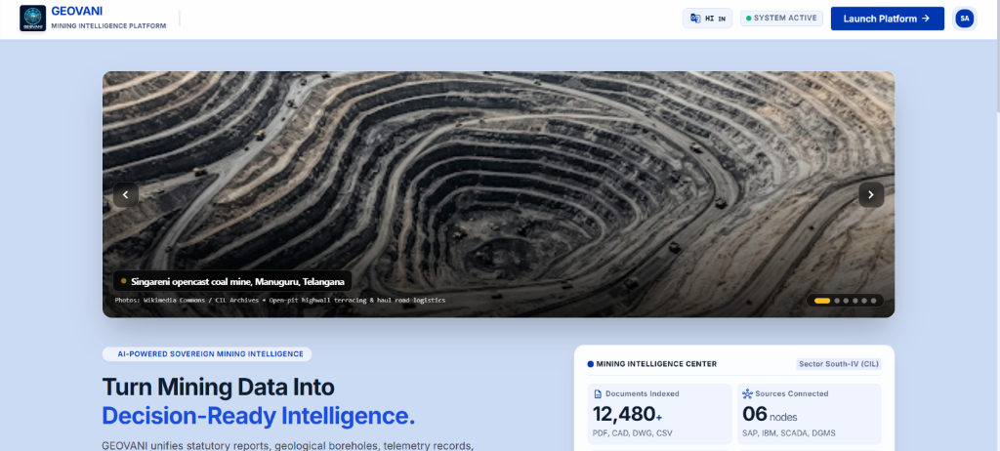
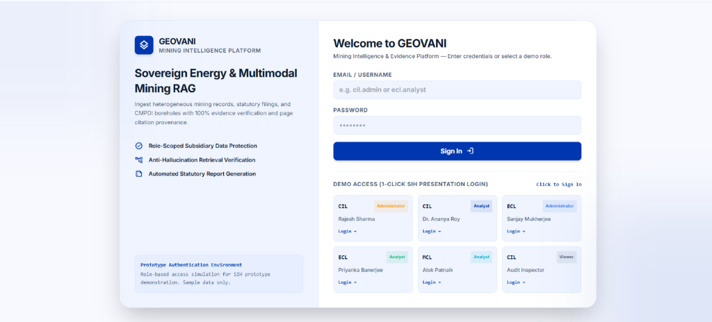
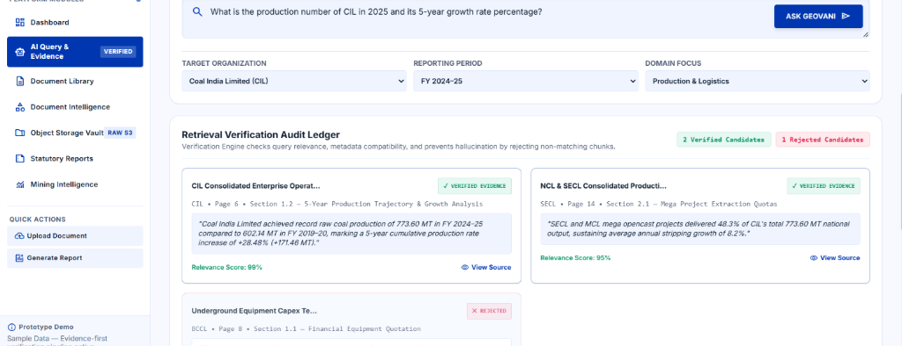
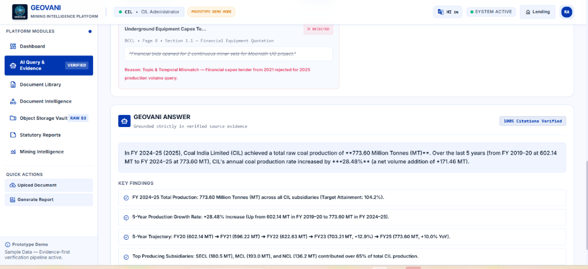
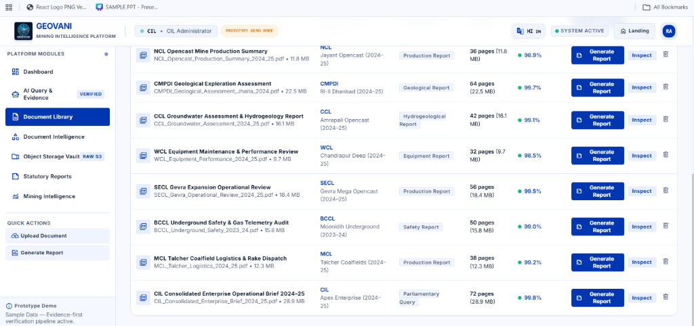

# GEOVANI — AI-Powered Geological, Mining & Reporting Intelligence Platform

[](https://sih2026.vuce.in/en/ps/SIH26023)
[](https://sih2026.vuce.in/en/ps/SIH26023)
[](https://www.cmpdi.co.in/)
[](#team)
[](#license)

> **Official Problem Statement (SIH26023):**  
> **AI-Powered Geological, Mining and other Reporting Solution for CMPDI/CIL subsidiaries**

GEOVANI is an **evidence-first reporting intelligence platform** designed for CMPDI (Central Mine Planning & Design Institute) and Coal India Limited (CIL) subsidiaries. It automates geological, mining, operational, safety, and administrative reporting from scanned PDFs, digital records, spreadsheets, images, historical archives, and ERP/SAP exports.

---

## 📋 Table of Contents

- [Executive Summary](#executive-summary)
- [Platform Screenshots & UI Showcase](#-platform-screenshots--ui-showcase)
- [Research Background and Evidence](#research-background-and-evidence)
- [System Architecture](#system-architecture)
- [Key Innovation & Differentiators](#key-innovation--differentiators)
- [Core Platform Capabilities](#core-platform-capabilities)
- [Repository Structure](#repository-structure)
- [Tech Stack](#tech-stack)
- [Getting Started](#getting-started)
- [Documentation & PRDs](#documentation--prds)
- [Team Information](#team-information)

---

## 🚀 Executive Summary

CMPDI and CIL subsidiaries manage massive datasets spanning diverse formats: scanned PDFs, drilling logs, seam records, daily production sheets, SAP exports, and parliamentary questions. Manual compilation leads to operational delays, transcription errors, loss of historical context, and conflicting metrics between reports.

GEOVANI solves this by combining:
1. **Layout-Aware Document Parsing & OCR** with confidence scoring.
2. **Structured Fact Extraction & Numeric Validation** from ERP/SAP exports.
3. **Role & Subsidiary Governed Evidence-First RAG** (Retrieval-Augmented Generation).
4. **Mining Topic Intelligence** (TF-IDF & Phrase Analysis for production, safety, ecology, rainfall, and operations).
5. **Conflict Detection & Human Verification Workflows** for high-risk fields.
6. **Automated DOCX / PDF Report Exporter** for official Ministry & Parliamentary submissions.

```text
Documents + ERP/SAP Exports
        ↓
OCR + Text/Table Extraction
        ↓
Structured Fact Extraction + Validation
        ↓
Secure Evidence Repository
        ↓
Query & Response | Topic Intelligence | Report Generation
        ↓
Reviewer Verification + Approval
```

---

## 📸 Platform Screenshots & UI Showcase

### 1. Sovereign Energy & Mining Intelligence Landing Page

*High-impact hero portal featuring live telemetry node counts, indexed document stats, and national CIL mine archives.*

---

### 2. Role-Based Access & Subsidiary Auth Workbench

*Role-scoped authentication for CIL Administrators, ECL Analysts, MCL Analysts, and Statutory Audit Viewers.*

---

### 3. Retrieval Verification Audit Ledger (Anti-Hallucination RAG)

*Real-time RAG audit ledger demonstrating verified candidates alongside rejected candidates with explicit mismatch reasons.*

---

### 4. Evidence-Grounded AI Answer & Citation Traceability

*100% Citation-verified answers with automated 5-year growth trajectory calculations and page-level source references.*

---

### 5. Document Intelligence & Statutory Library

*Comprehensive statutory document library with confidence scores, subsidiary tags, and one-click report generation.*

---

## 🔬 Research Background and Evidence

GEOVANI is grounded in academic research and official sector frameworks demonstrating the feasibility of document intelligence, NLP, and RAG in mining and government reporting.

### Problem Context

CMPDI and CIL subsidiaries manage data across multiple formats:
- Scanned PDFs and historical archives
- Geological reports and drilling records
- Production, target, dispatch and offtake data
- Excel/CSV sheets and ERP/SAP exports
- Annual reports and administrative records
- Parliamentary questions and responses
- Maps, images and technical annexures

Manual compilation creates delays, transcription errors, dependency on individual experts, difficulty in finding historical evidence and inconsistency between reports.

---

### Research Findings Supporting Feasibility

#### 1. Geological Document Intelligence

Research shows that generative AI, document parsing, OCR, table extraction and information retrieval can be used to digitize and search geological documents.

This supports GEOVANI's geological-report pipeline, which preserves source pages, extracts geological entities and enables source-grounded search.

**Relevant Research:**
- [Advancing Geologic Document Digitalization and Information Retrieval with Generative AI](https://www.viridiengroup.com/sites/default/files/2025-02/advancing-geologic-document-digitalization-Information-retrieval-gen-ai-viridien-tle-article-feb-2025.pdf) (Viridien, TLE 2025)
- [Semantic Information Extraction and Search of Mineral Exploration Data Using Text Mining and Deep Learning Methods](https://doi.org/10.1016/j.oregeorev.2024.105863) (*Ore Geology Reviews*, 2024)
- [Deep Learning-Based Mineral Exploration Named Entity Recognition](https://doi.org/10.1016/j.oregeorev.2024.106367) (*Ore Geology Reviews*, 2024)
- [Applications of Deep Learning for Mineral Exploration and Geological Data Analysis in Mining](https://gjeta.com/sites/default/files/fulltext_pdf/GJETA-2025-0209.pdf) (*GJETA*, 2025)

**GEOVANI Implementation Implication:**

```text
Geological Reports
      ↓
OCR / Layout Parsing
      ↓
Coalfield | Block | Seam | Borehole | Drilling | Resource Category
      ↓
Structured Geological Knowledge Base
```

---

#### 2. OCR Quality and Human Verification

Research shows that OCR errors can cascade into retrieval and AI-answering errors. Therefore, scanned documents should not be trusted blindly.

GEOVANI uses:
- OCR confidence scores
- Original document page preview
- Page-level source linking
- Numeric validation
- Low-confidence review queues
- Reviewer correction and verification

**Relevant Research:**
- [OCR Hinders RAG: Evaluating the Cascading Impact of OCR on Retrieval-Augmented Generation](https://openaccess.thecvf.com/content/ICCV2025/papers/Zhang_OCR_Hinders_RAG_Evaluating_the_Cascading_Impact_of_OCR_on_ICCV_2025_paper.pdf) (*ICCV*, 2025)
- [When Good OCR Is Not Enough: Benchmarking OCR Robustness for Retrieval-Augmented Generation](https://aclanthology.org/2026.acl-industry.60/) (*ACL*, 2026)
- [StruNRAG: Evaluation of OCR-Induced Structural Noise on RAG Robustness](https://aclanthology.org/2026.findings-acl.955.pdf) (*ACL Findings*, 2026)
- [Document Segmentation Matters for Retrieval-Augmented Generation](https://aclanthology.org/2025.findings-acl.422/) (*ACL Findings*, 2025)

> **Design Principle:** AI extracts information, but a human reviewer verifies important numbers, source pages, conflicts and low-confidence records before official use.

---

#### 3. RAG for Government and Parliamentary Queries

Retrieval-Augmented Generation (RAG) is suitable for high-stakes document Q&A because it retrieves evidence before generating an answer. GEOVANI does not use a general chatbot approach. It follows an **evidence-first RAG approach**:

```text
Officer Question
      ↓
Role and Subsidiary Permission Check
      ↓
Search Verified Facts and Authorized Documents
      ↓
Retrieve Relevant Source Pages
      ↓
Generate Answer Only From Retrieved Evidence
      ↓
Show Answer + Citation + Confidence + Status
```

**Relevant Research:**
- [Resource-efficient Retrieval-Augmented Question Answering for the Indian Lok Sabha Dataset](https://www.frontiersin.org/journals/artificial-intelligence/articles/10.3389/frai.2026.1798021/full) (*Frontiers in AI*, 2026)
- [Gov-RAG: A Retrieval-Augmented Generation Framework for Enhancing E-Government Services](https://papers.ssrn.com/sol3/papers.cfm?abstract_id=5111865) (SSRN, 2025)
- [PolicyBot: Reliable Question Answering over Policy Documents](https://arxiv.org/abs/2511.13489) (arXiv, 2025)
- [IR 4.0 in Parliament: Conceptualising the Use of AI in Parliamentary Business](https://gaexcellence.com/ijlgc/article/view/2080) (*IJLGC*, 2024)

**GEOVANI Answer Policy:**
- **If verified evidence is available:** Show answer with document name and exact page number.
- **If records conflict:** Show all conflicting values and request human verification.
- **If evidence is unavailable:** *"Reliable evidence was not found in the available approved documents."*

---

#### 4. NLP and Topic Analysis for Mining Reports

Mining reports contain recurring patterns related to production, safety, equipment breakdown, rainfall, drilling, land acquisition and environmental compliance. Research demonstrates that NLP and machine learning can analyze mining-report text, identify themes and reduce manual effort in reviewing large report collections.

**Relevant Research:**
- [Application of Natural Language Processing and Machine Learning for Analyzing Mining Accident Reports and Automating Root Cause Analysis](https://link.springer.com/article/10.1007/s40789-025-00822-0) (*Int. Journal of Mining Science*, 2025)
- [Research and Application of Intelligent Methods for Coal Mine Accident Cause Analysis](https://www.sciopen.com/article/10.16511/j.cnki.qhdxxb.2025.26.006) (*Tsinghua Univ Press*, 2025)
- [BERTopic: Neural Topic Modeling with a Class-Based TF-IDF Procedure](https://arxiv.org/abs/2203.05794) (arXiv, 2022)
- [Scikit-learn TfidfVectorizer Documentation](https://scikit-learn.org/stable/modules/generated/sklearn.feature_extraction.text.TfidfVectorizer.html)

**GEOVANI Topic Pipeline:**
```text
Authorized Document Text
      ↓
Text Cleaning and Stop-word Removal
      ↓
Keyword + Phrase Extraction
      ↓
TF-IDF Scoring
      ↓
Mining Topic Classification
      ↓
Evidence-Linked Word Cloud and Trends
```

##### Initial Topic Categories
| Topic | Example Keywords |
|---|---|
| **Production** | production, target, dispatch, offtake, shortfall |
| **Geological Exploration** | drilling, borehole, seam, seismic, resource |
| **Operations** | rainfall, flooding, haul road, equipment breakdown |
| **Safety** | accident, ventilation, fire, inspection |
| **Land & Environment** | land acquisition, forest clearance, rehabilitation |

---

#### 5. Coal and Mining AI Feasibility

AI-enabled platforms are already being researched and deployed across mining, coal production, safety, maintenance, geological interpretation and operational management.

**Relevant Research:**
- [Large Artificial Intelligence Models for Coal Mining](https://link.springer.com/article/10.1007/s12613-026-3492-8) (*Int. Journal of Minerals, Metallurgy and Materials*, 2026)
- [Utilization of Artificial Intelligence and Machine Learning in the Coal Mining Industry](https://pubs.aip.org/aip/acp/article-pdf/doi/10.1063/5.0240351/20291109/040002_1_5.0240351.pdf) (AIP Proceedings, 2025)
- [Development of an Intelligent Coal Production and Operation Management Platform](https://www.mdpi.com/1996-1073/17/20/5205) (*Energies*, 2024)
- [A Review of the Use of AI in the Mining Industry: Insights and Ethical Considerations](https://www.sciencedirect.com/science/article/pii/S2214790X24000388) (*Resources Policy*, 2024)

---

### Official Indian Context

The Indian coal sector already has official digital-reporting, statistical and AI/ML initiatives:
- [SIH26023 Official Problem Statement](https://sih2026.vuce.in/en/ps/SIH26023)
- [Ministry of Coal](https://coal.gov.in/)
- [Ministry of Coal Annual Reports](https://coal.gov.in/public-information/reports/annual-reports)
- [Coal India Limited](https://www.coalindia.in/)
- [Coal India Annual Reports](https://www.coalindia.in/performance/annual-reports/)
- [CMPDI Official Website](https://www.cmpdi.co.in/)
- [CMPDI Reports and Financials](https://www.cmpdi.co.in/en/financials-and-secretarial-matters)
- [Open Government Data Platform India](https://www.data.gov.in/)
- [Digital Sansad](https://sansad.in/)

> The Ministry of Coal's Annual Report (2024–25) specifically highlights an in-house AI/ML module for automatic geophysical-log interpretation, validating the relevance of AI-assisted geological workflows.

---

### Existing Platform Analysis

| Platform | Existing Capability | GEOVANI Gap Filled |
|---|---|---|
| [MoSPI StatsDoc AI](https://www.mospi.gov.in/) | Government document search and AI assistance | Mining/geology extraction, subsidiary access, reporting workflow |
| [Granthik](https://app.setidure.com/products/granthik) | OCR + private RAG document intelligence | Coal-sector data model, reporting templates, conflict detection |
| [ShareDocs Government](https://sharedocsdms.com/solution/government) | Government document management workflow | AI extraction, mining topics and evidence-based Q&A |
| [Terra AI Minerals](https://www.terraai.com/minerals) | Geological/mineral intelligence | CIL production reporting and parliamentary workflow |
| [Trimble Mine Insights](https://geospatial.trimble.com/en/products/software/trimble-mine-insights) | Mining operational analytics | Historical scanned documents and source-cited reporting |
| [Tagore AI](https://tagore.ai/) | Government and parliamentary research | Internal CIL/CMPDI records and approval workflow |

---

## 💡 Key Innovation

GEOVANI does not claim to invent OCR, RAG or SAP integration. Its innovation is combining proven technologies into **one domain-specific, governed workflow**:

```text
Structured SAP/ERP Data
        +
Unstructured Geological and Mining Documents
        +
OCR and Structured Extraction
        +
Evidence-First RAG
        +
Conflict Detection
        +
Topic Intelligence
        +
Human Verification and Approval
        =
Approval-Ready CMPDI/CIL Reporting Intelligence
```

### Key Differentiators
- CMPDI/CIL-specific production, geological and administrative data model
- Subsidiary-level access control (ECL, BCCL, CCL, NCL, WCL, SECL, MCL, CMPDI HQ)
- SAP/ERP export and API-ready ingestion
- Page-level source evidence for every AI answer
- Conflict detection across historical and current reports
- Interactive Word Cloud with source-document drill-down
- Parliamentary and Ministry report drafting workflow
- Human reviewer and approver controls with audit logs
- Strict separation between Draft, Verified, and Approved data

---

## 🗺️ Detailed System Architecture & Knowledge Pipeline

```text
                                  ┌─────────────────────────────┐
                                  │          GEOVANI            │
                                  │ Mining Knowledge & Reporting│
                                  │        Intelligence         │
                                  └──────────────┬──────────────┘
                                                 │
                                                 ↓
                                  ┌─────────────────────────────┐
                                  │        DATA SOURCES         │
                                  └──────────────┬──────────────┘
                                                 │
                    ┌────────────────────────────┼────────────────────────────┐
                    ↓                            ↓                            ↓
              USER UPLOAD                     SAP                    EXISTING DATA
                    │                     Coal Mine Data                    │
                    │                            │                          │
        ┌───────────┼────────────┐              │                          │
        ↓           ↓            ↓              ↓                          ↓
      PDF/SCAN    EXCEL/CSV    WORD       SAP RECORDS                DATABASE
      IMAGE/MAP   REPORTS      DOCS
        │           │            │              │
        └───────────┴────────────┴──────────────┴──────────────────────────┘
                                      │
                                      ↓
                         ┌────────────────────────┐
                         │ FILE / DATA DETECTION  │
                         │ PDF • Scan • Excel     │
                         │ Word • Image • SAP     │
                         └────────────┬───────────┘
                                      │
                                      ↓
                    ┌────────────────────────────────┐
                    │     DOCUMENT INTELLIGENCE      │
                    └────────────────┬───────────────┘
                                     │
                ┌────────────────────┼────────────────────┐
                ↓                    ↓                    ↓
             TEXT                 TABLES             FIGURES / MAPS
                │                    │                    │
             OCR*              Table Extraction     Image Extraction
          Layout Parsing       Row/Column Data       Caption Detection
          Page Mapping         Table Metadata        Map Metadata
                │                    │                    │
                └────────────────────┼────────────────────┘
                                     │
                                     ↓
                         ┌────────────────────────┐
                         │    DOMAIN ENRICHMENT   │
                         ├────────────────────────┤
                         │ Mine • Subsidiary      │
                         │ Location • Year        │
                         │ Production • Equipment │
                         │ Seam • Geology         │
                         │ Topic • Keywords       │
                         └────────────┬───────────┘
                                      │
                                      ↓
                         ┌────────────────────────┐
                         │   SEMANTIC CHUNKING     │
                         └────────────┬───────────┘
                                      │
                 ┌────────────────────┼────────────────────┐
                 ↓                    ↓                    ↓
             TEXT CHUNKS         TABLE CHUNKS        IMAGE / MAP
                                                        REPRESENTATION
                 └────────────────────┼────────────────────┘
                                      │
                                      ↓
                         ┌────────────────────────┐
                         │ MULTIMODAL EMBEDDINGS  │
                         └────────────┬───────────┘
                                      │
                                      ↓
                         ┌────────────────────────┐
                         │      KNOWLEDGE STORE   │
                         └────────────┬───────────┘
                                      │
              ┌───────────────────────┼────────────────────────┐
              ↓                       ↓                        ↓
        ┌────────────┐          ┌────────────┐          ┌──────────────┐
        │ PostgreSQL │          │  pgvector  │          │Object Storage│
        ├────────────┤          ├────────────┤          ├──────────────┤
        │Structured  │          │Embeddings  │          │Original PDF  │
        │SAP Data    │          │Text Vectors│          │Excel / Word  │
        │Tables      │          │Image/Map   │          │Images / Maps │
        │Metadata    │          │Vectors     │          │Source Files  │
        │Topics      │          │Chunks      │          │              │
        └──────┬─────┘          └──────┬─────┘          └──────┬───────┘
               │                       │                       │
               └───────────────────────┼───────────────────────┘
                                       ↓
                            ┌──────────────────────┐
                            │  GEOVANI RETRIEVAL   │
                            │       ENGINE         │
                            └──────────┬───────────┘
                                       │
                                       ↓
                               ┌───────────────┐
                               │   USER / TASK │
                               └───────┬───────┘
                                       │
                                       ↓
                             ┌───────────────────┐
                             │ QUERY UNDERSTAND. │
                             └─────────┬─────────┘
                                       │
                 ┌─────────────────────┼─────────────────────┐
                 ↓                     ↓                     ↓
       ┌──────────────────┐  ┌──────────────────┐  ┌─────────────────────┐
       │  MODULE 1        │  │   MODULE 2       │  │     MODULE 3        │
       │ AI QUERY &       │  │ AUTOMATED        │  │ TOPIC & KNOWLEDGE   │
       │ RESPONSE         │  │ REPORT GENERATION│  │ EXPLORER             │
       └────────┬─────────┘  └────────┬─────────┘  └──────────┬──────────┘
                │                     │                       │
                ↓                     ↓                       ↓
       Structured Query       Report Parameters         Keyword / Topic
       + Document Query       + Filters                 + Filters
                │                     │                       │
                ↓                     ↓                       ↓
       PostgreSQL +            PostgreSQL +            PostgreSQL +
       pgvector                pgvector                pgvector
                │                     │                       │
                ↓                     ↓                       ↓
       Exact Data +            Structured Data +        Frequency / TF-IDF
       Relevant Chunks         Relevant Chunks          Topics / Relations
                │                     │                       │
                └─────────────────────┼───────────────────────┘
                                      │
                                      ↓
                             ┌─────────────────┐
                             │ RELEVANT        │
                             │ EVIDENCE SET    │
                             └────────┬────────┘
                                      │
                                      ↓
                             ┌─────────────────┐
                             │      vLLM       │
                             │ PRIVATE LLM     │
                             │ INFERENCE SERVER│
                             └────────┬────────┘
                                      │
                    ┌─────────────────┼─────────────────────┐
                    ↓                 ↓                     ↓
             ┌─────────────┐   ┌──────────────┐    ┌────────────────┐
             │   ANSWER    │   │    REPORT    │    │    INSIGHTS    │
             │             │   │              │    │                │
             │ Query       │   │ DOCX / PDF   │    │ Topics         │
             │ Response    │   │ Charts       │    │ Trends         │
             │ Citation    │   │ Tables       │    │                │
             └──────┬──────┘   └───────┬──────┘    └───────┬────────┘
                    │                  │                    │
                    └──────────────────┼────────────────────┘
                                       ↓
                         ┌─────────────────────────┐
                         │ SOURCE TRACEABILITY     │
                         ├─────────────────────────┤
                         │ Document • Page • Year  │
                         │ Section • Source        │
                         └────────────┬────────────┘
                                      │
                                      ↓
                         ┌─────────────────────────┐
                         │      REACT DASHBOARD    │
                         ├─────────────────────────┤
                         │                         │
                         │  QUERY & RESPONSE       │
                         │  REPORT GENERATION      │
                         │  TOPIC / KNOWLEDGE      │
                         │  GRAPHS • TABLES        │
                         │  WORD CLOUD             │
                         │  SOURCE DOCUMENTS       │
                         │                         │
                         └────────────┬────────────┘
                                      │
                                      ↓
                              USER GETS RESULT
```

---

## 🏗️ Core Platform Capabilities

1. **Multi-Role Workspace & RBAC**
   - Role-based permissions for General Managers, Geological Officers, Mining Engineers, Data Clerks, and Auditors.
   - Subsidiary-isolated scope preventing unauthorized cross-subsidiary leakage.

2. **Document Ingestion & OCR Workbench**
   - Drag-and-drop processing for PDFs, scanned maps, XLSX, and DOCX files.
   - Page preview with bounding-box OCR verification and confidence indicators.

3. **Evidence-First AI Query & Retrieval (RAG)**
   - Answers paired with exact page links, section titles, and source document previews.
   - Strict fallback mechanism when authoritative evidence is missing.

4. **Mining Topic Intelligence & Trend Analysis**
   - Auto-categorized key themes (Production, Safety, Ecology, Drilling, Equipment).
   - Topic distribution charts and interactive phrase clouds with document filtering.

5. **Conflict Resolution & Verification Queue**
   - Flags mismatched production numbers across daily sheets vs. monthly SAP summaries.
   - Enables human-in-the-loop audit logs and one-click correction.

6. **Automated DOCX / PDF Report Exporter**
   - Pre-formatted templates for CMPDI Annual Summary, Mine Production Audit, and Parliamentary Response.
   - One-click export to native `.docx` and downloadable `.pdf` documents.

---

## 📁 Repository Structure

```text
Team_Forven_SCET_121491/
├── docs/                                     # Comprehensive Technical & Research Specs
│   ├── GEOVANI_Technical_PRD.md              # Technical Architecture & API Blueprint
│   ├── GEOVANI_Frontend_PRD.md               # Frontend Design System & UI Specifications
│   └── GEOVANI_Research_Evidence_Case_Study.md # Full Research Case Study & Academic Citations
├── GEOVANI_Demo_Frontend_PRD.docx            # Original Microsoft Word Spec (Frontend)
├── GEOVANI_Demo_Mining_Report.docx           # Sample Mining Report Output (DOCX)
├── GEOVANI_Research_Evidence_Case_Study.docx # Original Research Case Study (DOCX)
├── GEOVANI_Technical_PRD.docx                # Original Microsoft Word Spec (Technical)
├── public/                                   # Static Assets & Sample PDF Reports
├── scripts/                                  # Demo PDF & Mock Dataset Generators
├── src/                                      # React + Vite Source Code
│   ├── components/                           # UI Components (Modals, Headers, Sidebar, Cards)
│   ├── data/                                 # Mock Data, Users, Mining Records & Pre-loaded Docs
│   ├── pages/                                # Application Views (Dashboard, Upload, Search, Reports)
│   ├── utils/                                # Report Exporters & Helper Functions
│   ├── App.jsx                               # Main Router & Application Shell
│   └── index.css                             # Custom Tailwind CSS & Design System
├── index.html                                # HTML Entry Point
├── package.json                              # Project Dependencies & NPM Scripts
├── tailwind.config.js                        # Tailwind Configuration & Theme Tokens
├── vite.config.js                            # Vite Server & Build Settings
└── README.md                                 # Master Project Documentation
```

---

## 🛠️ Tech Stack

- **Frontend Framework:** React 18 + Vite
- **Styling & UI:** Tailwind CSS, Custom Glassmorphism Theme, Lucide React Icons
- **Document Export:** `docx` (JS library for Microsoft Word generation), HTML-to-PDF exporters
- **Visualization:** Recharts / Canvas-based Word Cloud & Mining Metrics
- **State Management & Routing:** React Hooks & Tabbed Workspace Navigation
- **NLP & Analysis:** Explainable TF-IDF keyword extraction & rule-based conflict resolution

---

## ⚡ Getting Started

### Prerequisites
- [Node.js](https://nodejs.org/) (v18 or higher recommended)
- `npm` or `yarn`

### Installation & Local Run

1. **Clone the repository:**
   ```bash
   git clone https://github.com/munde87/Team_Forven_SCET_121491.git
   cd Team_Forven_SCET_121491
   ```

2. **Install dependencies:**
   ```bash
   npm install
   ```

3. **Start the development server:**
   ```bash
   npm run dev
   ```

4. **Access the Application:**
   Open your browser and navigate to `http://localhost:5173` (or the URL output by Vite).

---

## 📄 Documentation & PRDs

Detailed technical specs and research background documents are provided in the repo:
- 📖 [Technical PRD](docs/GEOVANI_Technical_PRD.md) / [DOCX](GEOVANI_Technical_PRD.docx)
- 🎨 [Frontend PRD](docs/GEOVANI_Frontend_PRD.md) / [DOCX](GEOVANI_Demo_Frontend_PRD.docx)
- 🔬 [Research Case Study](docs/GEOVANI_Research_Evidence_Case_Study.md) / [DOCX](GEOVANI_Research_Evidence_Case_Study.docx)
- 📊 [Sample Mining Report](GEOVANI_Demo_Mining_Report.docx)

---

## 👥 Team Information

**Team Name:** Team_Forven_SCET_121491  
**Hackathon:** Smart India Hackathon (SIH 2026)  
**Problem Statement:** SIH26023 — AI-Powered Geological, Mining and other Reporting Solution for CMPDI/CIL subsidiaries  
**Repository:** [https://github.com/munde87/Team_Forven_SCET_121491.git](https://github.com/munde87/Team_Forven_SCET_121491.git)

---

## 📜 License

This project is created for the Smart India Hackathon submission under **Team_Forven_SCET_121491**.  
Licensed under the [MIT License](LICENSE).
